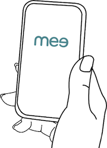

## What is a smartwallet?

**Your digital twin**

- An identity agent gives you an independent, digital embodiment that you entirely control.

**A “Remote control” for your personal data**

- Retrieves your data from apps/sites you use.
- Organizes it conveniently in one place.
- Provides a single, central place to edit your data and update all the apps/sites that use it.

**Private sharing**

- You decide what to share and with whom. Mee-compatible apps/sites will never share/sell it without your consent.

**Privacy and security**

- Opts you out of sharing/selling your personal information by websites.
- Your personal data is stored securely on your device. 